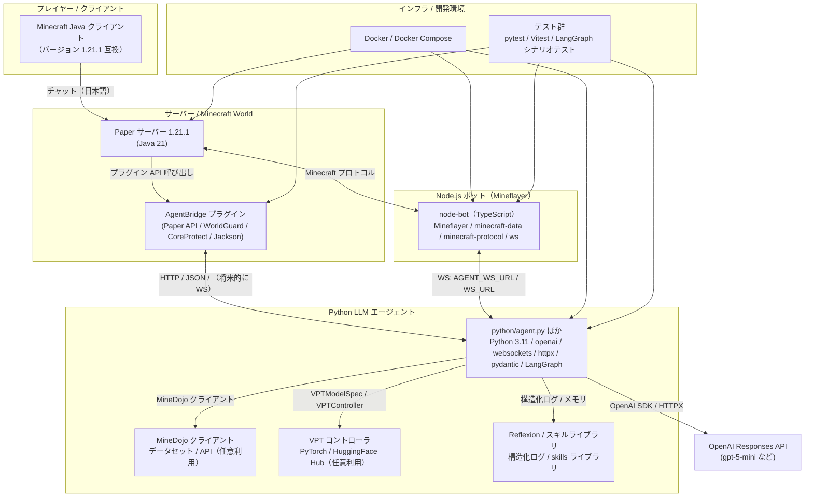
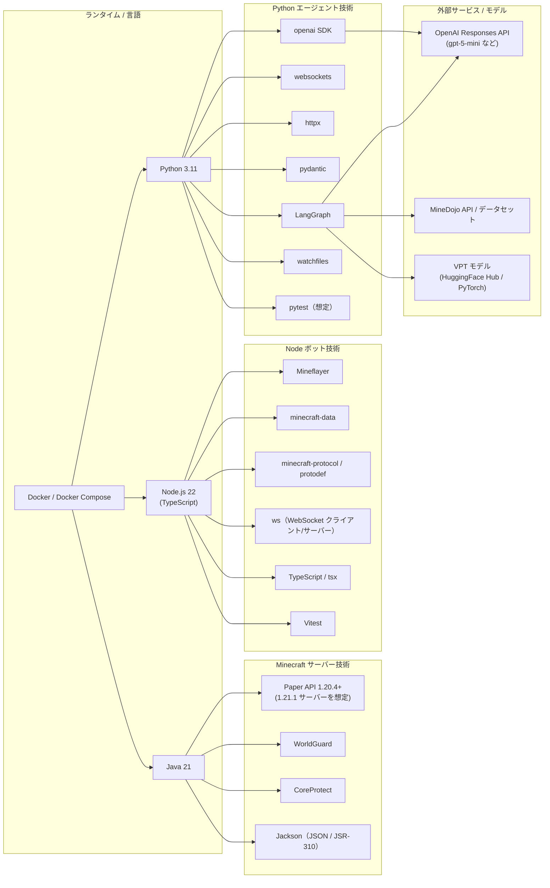

# 技術スタックと相関関係図

このドキュメントは、本プロジェクトで採用している主要技術と、それらがどのように連携して Minecraft 自律ボットを構成しているかを **1 枚の図で俯瞰できる** ようにまとめたものです。README のアーキテクチャ概要を補完し、「どのレイヤーで何が動いているか」を新人メンバーが短時間でキャッチアップできることを目的とします。

---

## 1. 全体アーキテクチャ（レイヤー別）

プレイヤーのチャットがどの技術レイヤーを経由して処理されるかを、技術スタック込みで図示します。

### 1.1 レイヤーごとの役割整理

- **クライアント層**: 実プレイヤーが操作する Minecraft クライアント。技術的には Vanilla だが、プロトコルバージョンが Paper / Mineflayer と合うことが重要です。
- **サーバー層（Paper + AgentBridge）**: Minecraft のワールドそのものをホストしつつ、AgentBridge プラグインが WorldGuard / CoreProtect と連携し、「どの領域を掘ってよいか」「どのブロックが保護されているか」といった情報を HTTP 経由でエージェントへ渡します。
- **Node.js ボット層（Mineflayer）**: 実際にワールド内で動き回るボット。Mineflayer と minecraft-protocol が Minecraft プロトコルの詳細を吸収し、Python 側からは「コマンド」として高レベルに制御できるようにします。
- **Python LLM エージェント層**: チャット解釈・タスク分解・LangGraph によるフロー制御・Reflexion に基づく自己評価を担う中枢。OpenAI Responses API / MineDojo / VPT など、外部の知識ソース・モデルへここから接続します。
- **インフラ層（Docker / テスト）**: Python / Node 双方のホットリロードと依存管理、pytest / Vitest / LangGraph シナリオによる回帰テストを一括で支える層です。

---

## 2. 採用技術カタログと相関関係（技術観点）

上記のレイヤーを「どの言語・ランタイム・ライブラリを組み合わせて実現しているか」という **技術観点** で整理した図です。

### 2.1 技術相関の読み方（本質的なポイント）

- **Java 系技術のまとまり**: Paper / WorldGuard / CoreProtect / Jackson はすべて Java 上で動き、AgentBridge プラグイン内で完結する。「ワールドの状態をどう解釈してボットに公開するか」を Java 側で前処理しているイメージです。
- **Node.js 系技術のまとまり**: Mineflayer と minecraft-protocol が Minecraft プロトコルの扱いを抽象化し、TypeScript + tsx + Vitest が開発体験とテストを支えます。ここでは「Minecraft サーバーとのネットワーク I/O を安全に隠蔽する」ことが本質です。
- **Python 系技術のまとまり**: OpenAI SDK / LangGraph / websockets / httpx / pydantic が「LLM 呼び出し・状態管理・外部サービス統合」の中心です。ここでは「チャットを高レベルな意図へ変換し、計画と実行フローをグラフとして管理する」ことが本質です。
- **外部サービスとの接続点**: OpenAI / MineDojo / VPT はすべて Python 層からアクセスされ、Node / Java からは直接触りません。問題が起きたときに「LLM 側の問題か、Mineflayer 側の問題か」を切り分けやすくするための分離でもあります。
- **Docker / テストの役割**: Docker Compose は Node / Python / Paper のバージョンや依存関係を固定し、pytest / Vitest / LangGraph のシナリオテストが振る舞いの回帰を保証します。「技術選定の良し悪し」よりも、「技術の組み合わせを再現可能に保つ仕組み」として位置づけるのがポイントです。

---

## 3. 新人向けの読み方ガイド

このドキュメントを初めて読むメンバーは、次の順序で追いかけると全体像をつかみやすくなります。

1. **図 1（全体アーキテクチャ）で「どのレイヤーがあるか」を把握する**  
   - プレイヤー → Paper + AgentBridge → Node（Mineflayer）→ Python（LLM）→ OpenAI/MineDojo/VPT  
   という大きな流れだけをまず頭に入れてください。
2. **図 2（技術カタログ）で「どの言語がどのライブラリを抱えているか」を確認する**  
   - Java / Node / Python の 3 つに分けて、「どの技術スタックを触ると何が壊れそうか」の感覚を持つことが目的です。
3. **実装を読むときは、必ず「レイヤー」を意識する**  
   - 例: Minecraft プロトコルに近い話は `node-bot`、LLM プロンプトや LangGraph の挙動は `python`、ワールドの保護・ログは `bridge-plugin` といった形で、責務の分担を意識してコードを追うと理解が早くなります。
4. **詳細仕様は README / 個別ドキュメントへリンクする**  
   - 建築系の挙動: `docs/building_state_machine.md`  
   - トンネルモードや採掘ジョブ: `docs/tunnel_mode_design.md`  
   - MineDojo 連携の細部: `docs/minedojo_integration.md`  
   本ファイルは「鳥瞰図」の役割であり、詳細なアルゴリズムやプロンプト設計はこれらのドキュメントで補完されます。

