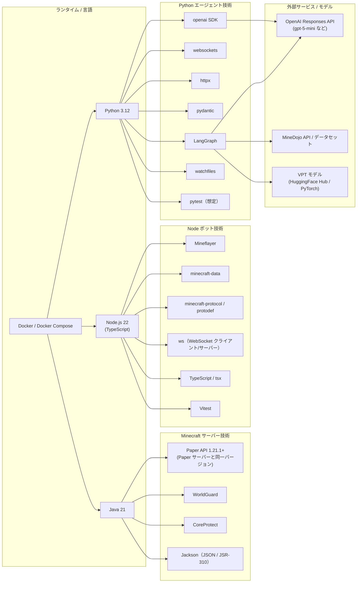

# 技術スタックと相関関係図

このドキュメントは、本プロジェクトで採用している主要技術と、それらがどのように連携して Minecraft 自律ボットを構成しているかを **1 枚の図で俯瞰できる** ようにまとめたものです。README のアーキテクチャ概要を補完し、「どのレイヤーで何が動いているか」を新人メンバーが短時間でキャッチアップできることを目的とします。

---

## 1. 全体アーキテクチャ（レイヤー別）

プレイヤーのチャットがどの技術レイヤーを経由して処理されるかを、技術スタック込みで図示します。


### 1.1 レイヤーごとの役割整理

- **クライアント層**: 実プレイヤーが操作する Minecraft クライアント。技術的には Vanilla だが、プロトコルバージョンが Paper / Mineflayer と合うことが重要です。
- **サーバー層（Paper + AgentBridge）**: Minecraft のワールドそのものをホストしつつ、AgentBridge プラグインが WorldGuard / CoreProtect と連携し、「どの領域を掘ってよいか」「どのブロックが保護されているか」といった情報を HTTP 経由でエージェントへ渡します。
- **Node.js ボット層（Mineflayer）**: 実際にワールド内で動き回るボット。Mineflayer と minecraft-protocol が Minecraft プロトコルの詳細を吸収し、Python 側からは「コマンド」として高レベルに制御できるようにします。
- **Python LLM エージェント層**: チャット解釈・タスク分解・LangGraph によるフロー制御・Reflexion に基づく自己評価を担う中枢。OpenAI Responses API / MineDojo / VPT など、外部の知識ソース・モデルへここから接続します。
- **インフラ層（Docker / テスト）**: Python / Node 双方のホットリロードと依存管理、pytest / Vitest / LangGraph シナリオによる回帰テストを一括で支える層です。

---

## 2. 採用技術カタログと相関関係（技術観点）

上記のレイヤーを「どの言語・ランタイム・ライブラリを組み合わせて実現しているか」という **技術観点** で整理した図です。



### 2.1 技術相関の読み方（本質的なポイント）

- **Java 系技術のまとまり**: Paper / WorldGuard / CoreProtect / Jackson はすべて Java 上で動き、AgentBridge プラグイン内で完結する。「ワールドの状態をどう解釈してボットに公開するか」を Java 側で前処理しているイメージです。
- **Node.js 系技術のまとまり**: Mineflayer と minecraft-protocol が Minecraft プロトコルの扱いを抽象化し、TypeScript + tsx + Vitest が開発体験とテストを支えます。ここでは「Minecraft サーバーとのネットワーク I/O を安全に隠蔽する」ことが本質です。
- **Python 系技術のまとまり**: OpenAI SDK / LangGraph / websockets / httpx / pydantic が「LLM 呼び出し・状態管理・外部サービス統合」の中心です。ここでは「チャットを高レベルな意図へ変換し、計画と実行フローをグラフとして管理する」ことが本質です。
- **外部サービスとの接続点**: OpenAI / MineDojo / VPT はすべて Python 層からアクセスされ、Node / Java からは直接触りません。問題が起きたときに「LLM 側の問題か、Mineflayer 側の問題か」を切り分けやすくするための分離でもあります。
- **Docker / テストの役割**: Docker Compose は Node / Python / Paper のバージョンや依存関係を固定し、pytest / Vitest / LangGraph のシナリオテストが振る舞いの回帰を保証します。「技術選定の良し悪し」よりも、「技術の組み合わせを再現可能に保つ仕組み」として位置づけるのがポイントです。

---

## 3. 新人向けの読み方ガイド

このドキュメントを初めて読むメンバーは、次の順序で追いかけると全体像をつかみやすくなります。

1. **図 1（全体アーキテクチャ）で「どのレイヤーがあるか」を把握する**  
   - プレイヤー → Paper + AgentBridge → Node（Mineflayer）→ Python（LLM）→ OpenAI/MineDojo/VPT  
   という大きな流れだけをまず頭に入れてください。
2. **図 2（技術カタログ）で「どの言語がどのライブラリを抱えているか」を確認する**  
   - Java / Node / Python の 3 つに分けて、「どの技術スタックを触ると何が壊れそうか」の感覚を持つことが目的です。
3. **実装を読むときは、必ず「レイヤー」を意識する**  
   - 例: Minecraft プロトコルに近い話は `node-bot`、LLM プロンプトや LangGraph の挙動は `python`、ワールドの保護・ログは `bridge-plugin` といった形で、責務の分担を意識してコードを追うと理解が早くなります。
4. **詳細仕様は README / 個別ドキュメントへリンクする**  
   - 建築系の挙動: `docs/building_state_machine.md`  
   - トンネルモードや採掘ジョブ: `docs/tunnel_mode_design.md`  
   - MineDojo 連携の細部: `docs/minedojo_integration.md`  
   本ファイルは「鳥瞰図」の役割であり、詳細なアルゴリズムやプロンプト設計はこれらのドキュメントで補完されます。

---

## 4. 能動的世界文脈配信ロードマップ

Paper 側でプロアクティブに危険通知やジョブ状況を配信し、LangGraph 側の `detection_reports`（`python/agent_orchestrator.py::build_reflection_prompt`）へ自動で取り込むための計画をまとめる。

### 4.1 Paper → LangGraph Push

- `bridge-plugin/src/main/java/com/example/bridge/AgentBridgePlugin.java` で Paper イベントリスナー（WorldGuard／CoreProtect／液体検知）を登録し、`BridgeEventHub` へ `region_hazard` / `job_state` / `world_alert` などの `BridgeEvent` を publish する。
- HTTP 層では既存の SSE `/v1/events/stream` を強化しつつ、新たに WebSocket `/v1/events/ws` を追加して LangGraph ノードが pull せずともリアルタイムに push を受け取れるようにする。`bridge-plugin/src/main/java/com/example/bridge/http/BridgeHttpServer.java` の `EventStreamHandler` を共通のイベントマルチプレクサに差し替える想定。
- Python 側では `BridgeClient.consume_event_stream()` と `agent.py::_handle_bridge_event()` を使い回し、チャットレス運用でも `BridgeEvent` が `bridge_event_reports` → `detection_reports` に自動でマージされる。これにより「今どこを掘れるか」を毎回ユーザーが質問する必要がなくなる。
- 2025/11 アップデートでは `BridgeEvent` に `attributes` フィールドを追加し、ジョブ ID・危険カテゴリ・WorldGuard リージョン・液体/空洞カウントを SSE 上で共有できるようになった。Python 側はこれを `perception_summary` と統合し、周辺状況を 1 行で LLM へ渡す。
- Python エージェントでは `BridgeClient.consume_event_stream()` → `Agent._handle_bridge_event()` → `Agent._ingest_perception_snapshot()` の経路で `perception_history_limit` 件の `perception_snapshots` / `bridge_event_reports` を更新し、LangGraph プロンプトや `Memory` で即座に再利用できる。

---

## 5. 自然言語→LangGraph→Mineflayer フロー（ActionDirective ビュー）

| 段階 | 役割 | 生成データ |
| --- | --- | --- |
| `planner.plan()` | Responses API → LangGraph | `PlanOut.goal_profile` / `constraints` / `execution_hints` / `directives` / `recovery_hints` |
| `agent.AgentOrchestrator._execute_plan()` | LangGraph → Mineflayer | directive ごとに `executor`（`mineflayer` / `minedojo` / `chat`）を参照し、`Actions` へ meta 付きでディスパッチ |
| Node Telemetry | `node-bot/runtime/telemetry.ts` | `command.meta.directive_id` / `directive.executor` を span 属性とメトリクス（`mineflayer.directive.received`）に記録 |

- **Goal Profile**: gpt-5-mini から返された `goal_profile` は「誰のための作業か」「成功条件は何か」「優先度は？」を LangGraph 側で可視化するために用います。`docs/minedojo_integration.md` と同じ `mission_id` / `tags` がここにも含まれます。
- **ActionDirective**: `directives[n]` は plan ステップと 1:1 で紐づき、`category`・`executor`・`args.coordinates` を明示します。Python 側は directive が指定された場合にヒューリスティックを飛ばし、Mineflayer / MineDojo / チャットのいずれかへ直行します。
- **Recovery Hints**: `recovery_hints` は `langgraph_state.record_recovery_hints()` でステートに残り、再計画プロンプトと `memory.recovery_hints` の双方に同期されます。障壁が多発するステップを directive レベルで切り分けられるため、次のチャットに答える前に再計画ポリシーを切り替えられます。

新しい DSL を参照する際は README の「3.2.5 自然言語→ActionDirective DSL」と `python/planner.py` の JSON 例を合わせて確認してください。
### 4.2 LangGraph 逆通知の再設計

- `LangGraphRetryHook`（`bridge-plugin/src/main/java/com/example/bridge/langgraph/LangGraphRetryHook.java`）を `LangGraphEventGateway` に拡張し、`triggerRetry` に加えて `pushEvent(LangGraphEvent event)` を提供する。`LangGraphRetryClient` も push 用エンドポイント（例: `/callbacks/agentbridge/events`）を持つクライアントへ差し替える。
- `BridgeEvent` publish 時に `pushEvent` を呼び、LangGraph 側の専用ノードへ「どの保護領域で何が起きたか」「危険度」「最新ジョブ ID」を直接通知する。LangGraph ノードでは `bridge_event_reports` を `state["detection_reports"]` に積み増し、`build_reflection_prompt()` が失敗理由へ自動添付できる。
- 逆通知を同じゲートウェイにまとめることで、Paper → LangGraph の危険共有と LangGraph → Paper のリトライ指示が単一の設定 (`langgraph.*` セクション) に収まる。設定値は API キーと両方向のエンドポイントを environment config で一元管理する。

### 4.3 CLI / 運用フロー

- （計画中）blazity の CLI/Client パターンに倣い、`python/cli.py` へ `agentbridge jobs watch` サブコマンドを追加して SSE/WS を購読し、`job_started` や `danger_detected` のタイムラインをターミナルへ streaming 表示する。`--job-id` フィルタや `--format json` などのフラグで運用向けの絞り込みを用意する。
- CLI からも `BRIDGE_EVENT_STREAM_PATH` / `BRIDGE_EVENT_STREAM_ENABLED` を尊重し、サーバーを UI なしで観測できるようにする。Paper 側のイベントを LangGraph だけでなく SRE/運用担当にも共有することで、チャット不在時でも危険通知が可視化される。
- 上記 2 つの取り組みにより、「Python 側から問い合わせない限り Paper が沈黙する」という現状を解消し、LangGraph と CLI の両方で保護領域や危険ブロックを push で受け取れる構造に進化させる。


## 6. ギャップ分析（2025-11-30 時点）

LangGraph / Mineflayer / MineDojo / AgentBridge（Paper）/ OpenAI / blazity CLI パターンを組み合わせる際のボトルネックを、認知・計画・実行・可観測性の 4 軸で整理します。

### 6.1 認知レイヤー（LangGraph × Mineflayer × Paper × Minecraft）

- `python/agent.py` の `_summarize_perception_snapshot` は液体・敵対モブ・照度などを 1 行の文字列へ圧縮しており、座標系や過去イベントとの時間的な相関が LangGraph に届かないため、曖昧な自然言語指示に対して「いま危険なのか？」を推論しづらい状態です。`bridge_event_reports` も同一メモリスロットへ 10 件だけ保持しており（`_handle_bridge_event` 参照）、AgentBridge が送る Paper 側の危険アラートと Node 側の `perception` が分断されています。```893:961:python/agent.py // ...``` 

### 6.2 計画レイヤー（LangGraph × OpenAI）

- `PlanPriorityManager` が `evaluate_confidence_gate` を持ち、`pre_action_review` ノードで確信度が低いプランを自動確認に回すようになりました。Responses API を使ってソクラテス式のフォローアップ文を生成し、`plan_out.next_action="chat"` へ切り替えます。```557:592:python/planner.py // pre_action_review``` ```67:108:python/planner.py```
- それでも `PlanOut.goal_profile.blockers` や `execution_hints` を確認プロンプトへ十分活かし切れておらず、`gatherStatus(kind="environment")` などの追加観測はまだ自動挿入されていません。

### 6.3 実行レイヤー（Mineflayer × VPT × LangGraph）

- `ActionDirective.executor == "hybrid"` は `python/agent.py` の `_parse_hybrid_directive_args` 経由で `args.vpt_actions` / `args.fallback_command` を検証し、`Actions.execute_hybrid_action` によって VPT → コマンドの順で安全にフェイルオーバーする実装へ更新済みです。```1286:1388:python/agent.py```
- Mineflayer 側では `CONTROL_MODE` に `hybrid` を追加し、通常は `command` モードで行動しつつ `playVptActions` を受け取ったときだけ VPT 再生を許可します。これにより LangGraph が指示単位で VPT を挿入できるようになりました。```44:52:node-bot/bot.ts``` ```1868:1874:node-bot/bot.ts```

### 6.4 スキル / 可観測性レイヤー（MineDojo × Paper × blazity CLI）

- `MineDojoSelfDialogueExecutor` を `pre_action_review` や空プラン時に自律呼び出す `_maybe_trigger_minedojo_autorecovery` を追加し、LLM が手順を返せなかった場合でも自己対話ログを使ったスキル登録とチャット通知を自動化しました。```1229:1291:python/agent.py```
- AgentBridge の SSE を CLI でも購読できるよう `agentbridge jobs watch` を追加したため、チャットが不在でも `warning`/`fault` レベルのイベントを即座に確認できます。次の課題はイベント内容を LangGraph の `detection_reports` と照合し、危険度分析を共通化することです。


## 7. 改善提案ロードマップ（LangGraph / Mineflayer / MineDojo / Paper / OpenAI / blazity）

ギャップに対する具体的な改善ステップを、アーキテクチャ別に列挙します。

### 7.1 Context Fabric（認知強化）

- **目的**: Mineflayer の `perception`、AgentBridge (Paper) の SSE、Minecraft ワールド座標を LangGraph の状態として統合し、人間のように「場の空気」を掴めるようにする。
- **実装案**:
  - `Memory` に `perception_timeline` ストアを追加し、過去 N 件の観測を座標付き JSON で保持。
  - LangGraph の `prepare_payload` ノードで `perception_timeline` と `bridge_event_reports` を取り込み、OpenAI Responses API へのコンテキストとして `context["perception_fabric"]` を注入。
  - AgentBridge プラグインには軽量な `/v1/events/ws` を追加し、Mineflayer 未起動時も Paper から危険通知を push（既存 SSE の課題を補完）。

### 7.2 Socratic Confidence Gate（計画強化）

- **目的**: LangGraph が `PlanOut.confidence` や `clarification_needed` を解釈し、曖昧な自然言語でも自律的に追加観測→確認を挟めるようにする。
- **実装案**:
  - `PlanPriorityManager` に `confidence_thresholds` を導入し、Responses API からのスコアを基に `pre_action_review` ノードへ遷移させる。（実装済み）
  - 今後は `pre_action_review` から `gatherStatus(kind="environment")` を自動呼び出し、OpenAI へ送る文脈に最新の認知データを含める。
  - 確認が必要な場合は `actions.say` ではなく、ActionDirective backlog に `ask_confirmation` を積むだけにして再計画を優先させる。

### 7.3 Hybrid Directive Executor（実行強化）

- **目的**: LangGraph から指示単位で Mineflayer コマンド制御と VPT 再生を切り替え、複雑な操作は VPT へ委譲する。
- **実装内容**:
  - `AgentOrchestrator._execute_plan()` が `directive.executor == "hybrid"` を検知すると `Actions.execute_hybrid_action()` を呼び出し、VPT 成功時はそのまま完了、失敗時は `args.fallback_command` を自動送信します。
  - `CONTROL_MODE=hybrid` を指定すると Mineflayer が `command` モードを維持したまま `playVptActions` を受け付けるため、既存のコマンド系タスクと VPT 再生をシームレスに混在させられます。
  - directive メタデータは OpenTelemetry / メトリクスに転記されるため、`directive.executor` ごとの成功率・所要時間を容易に観測できます。

### 7.4 Skill Feedback Loop & CLI Telemetry（スキル/可観測性強化）

- **目的**: MineDojo のデモ取得・スキル登録・Paper からの危険通知を 1 つのフィードバックループにまとめ、blazity 風 CLI で観測できるようにする。
- **実装案**:
  - `MineDojoSelfDialogueExecutor` に「PlanOut 失敗時の自動呼び出し」フラグを追加し、再計画フェーズでサンプルプレイバックを自動生成。
  - `SkillRepository` へ MineDojo ミッション ID と AgentBridge からの環境タグを紐づけ、似た状況が再度発生したときに LangGraph から `invokeSkill` を優先。
  - `python/cli.py` に `agentbridge hazards tail` のような追加ビューを実装し、SSE と LangGraph の `detection_reports` をまとめてフィルタリングできる UI を整備する。

これらの提案は README のロードマップとリンクさせ、新規メンバーが自然言語インタラクション改善の方向性をすぐに理解できるようにします。

